# Beyond Error: Bias-Variance Analysis of Ensemble Methods

**CSML Final Project** — Yash Gawankar  
Report: [Beyond Error: Why Ensembles Work Until They Don't](./Final%20Project%20Report.pdf)

---

## Datasets

| Dataset | File / Source |
|---------|--------------|
| **Synthetic** | [`synthetic_dataset.csv`](./synthetic_dataset.csv) — 10,000 rows × 15 features + target, generated with `make_regression(n_samples=10000, n_features=15, n_informative=8, noise=15.0, random_state=42)` |
| **California Housing** | Built into scikit-learn — loaded via `sklearn.datasets.fetch_california_housing`. [Dataset description](https://scikit-learn.org/stable/datasets/real_world.html#california-housing-dataset) (Pace & Barry, 1997; 1990 U.S. Census). No download required. |

---

## Setup

```bash
# Clone the repo
git clone https://github.com/yashgawankar/Ensembles.git
cd Ensembles

# Install dependencies (Python 3.9+)
pip install -r requirements.txt
```

---

## Reproducing All Results

### Step 1 — Synthetic dataset (tuned hyperparameters)

Runs all four trajectory experiments (E1–E4), all hybrid mixing experiments (E5–E6),
and theory validation. Saves results, plots, and hypothesis verdicts.

```bash
python main.py --dataset synthetic --results-dir ./results_tuned --plots-dir ./plots_tuned
```

> Full run takes ~1–2 hours (50 bootstrap iterations × all sweep configs).  
> For a quick smoke-test (~2 min):
> ```bash
> python main.py --dataset synthetic --results-dir ./results_quick --n-bootstrap 5 --quick
> ```

### Step 2 — California Housing dataset

Same experiments on real data (noise experiment E3 is automatically skipped for real datasets).

```bash
python main.py --dataset california --results-dir ./results_california_tuned --plots-dir ./plots_california_tuned
```

### Step 3 — Run a specific experiment only

```bash
# E1 only (ensemble size)
python main.py --dataset synthetic --experiments ensemble_size

# E1 + E2 only
python main.py --dataset synthetic --experiments ensemble_size depth
```

### Step 4 — Resume an interrupted run

Already-computed configs are detected and skipped automatically:

```bash
python main.py --dataset synthetic --results-dir ./results_tuned
```

---

## Output Files

After a full run, `results_tuned/` and `results_california_tuned/` contain:

```
results_tuned/
├── experiments/
│   ├── ensemble_size.json     # Bias², Variance, MSE at every sweep value
│   ├── depth.json
│   ├── noise.json
│   └── train_size.json
├── hybrids/
│   ├── convex_rf_xgb.json     # MSE vs lambda for convex hybrid
│   ├── prob_rf_xgb.json       # MSE vs lambda for probabilistic hybrid
│   └── ...                    # rf_svr, xgb_svr pairs
├── all_results.csv            # Flat table of all scalar metrics
├── theory_validation.csv      # Theoretical vs empirical lambda* comparison
└── hypothesis_verdicts.csv    # Programmatic H1–H9 verdicts
```

Plots are saved to `plots_tuned/` and `plots_california_tuned/`.

---

## CLI Reference

| Flag | Default | Description |
|------|---------|-------------|
| `--dataset` | `synthetic` | `synthetic` · `california` · `csv` |
| `--csv-path` | — | Path to CSV (required if `--dataset csv`) |
| `--target-col` | — | Target column name (required if `--dataset csv`) |
| `--results-dir` | `./results` | Directory to save / resume from |
| `--plots-dir` | `./plots` | Directory to save plots |
| `--n-bootstrap` | `50` | Bootstrap iterations |
| `--experiments` | all | Subset: `ensemble_size` `depth` `noise` `train_size` |
| `--quick` | off | Reduce sweep values for fast testing |
| `--no-plots` | off | Skip plot generation |
| `--verbose` | off | Per-iteration logging |

---

## Plots

### Synthetic Data — Trajectory Atlas (E1–E4)

| E1: Ensemble Size | E2: Depth | E3: Noise | E4: Train Size |
|:-:|:-:|:-:|:-:|
| 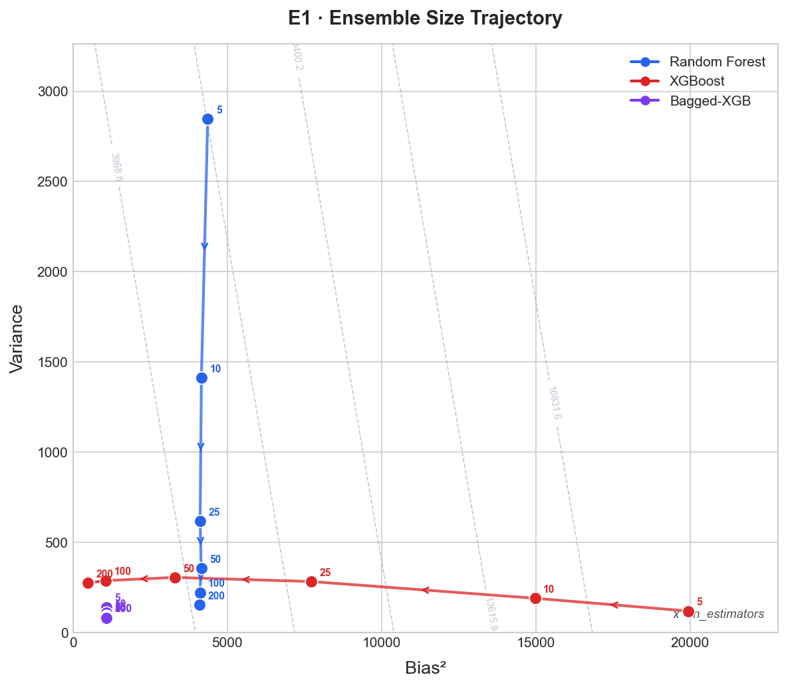 | 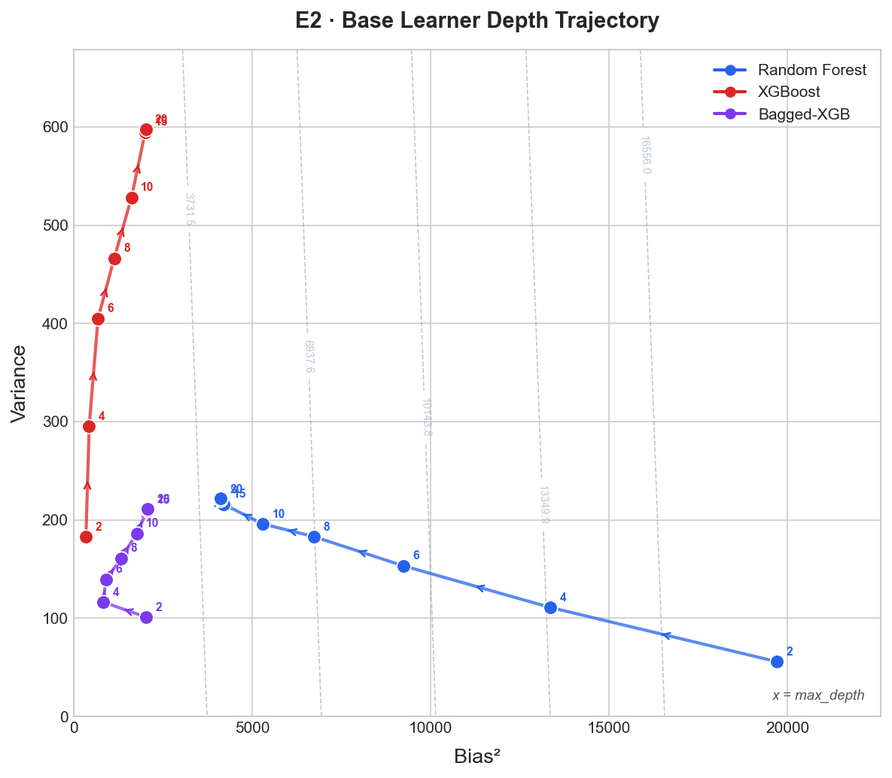 | 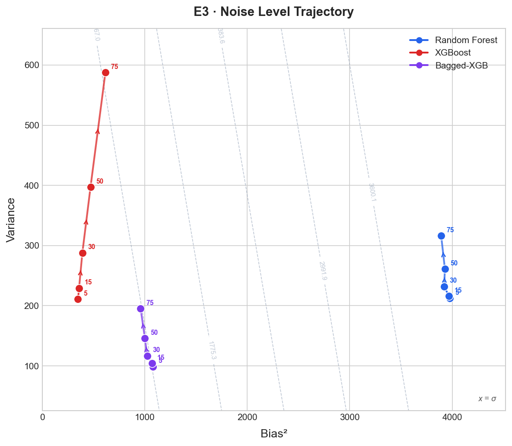 | 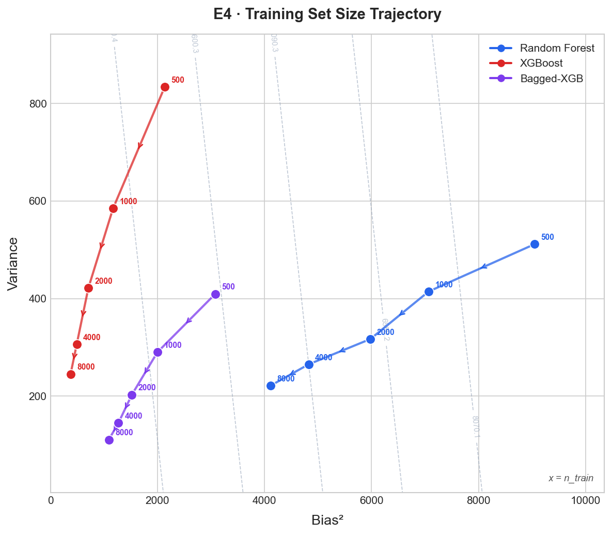 |

RF moves vertically (variance reduction); XGB moves horizontally (bias reduction) — orthogonal mechanisms in Bias²-Variance space.

### California Housing — Trajectory Validation

| E1: Ensemble Size | E2: Depth | E4: Train Size |
|:-:|:-:|:-:|
| 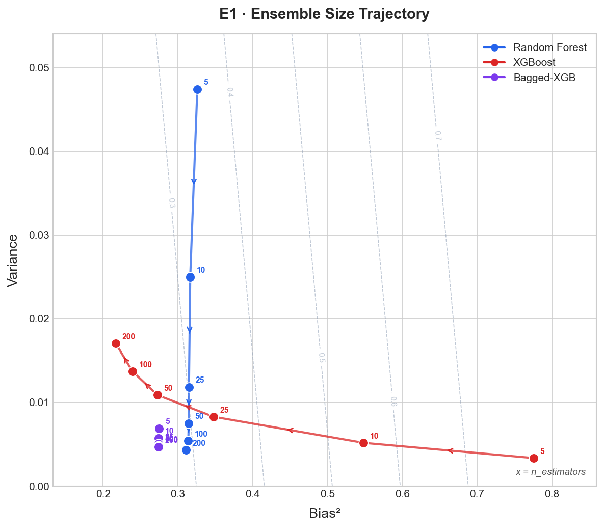 | 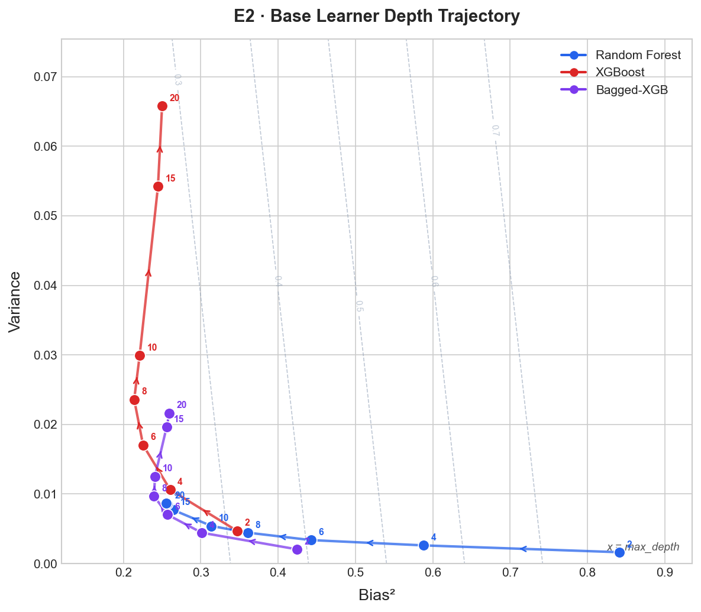 | 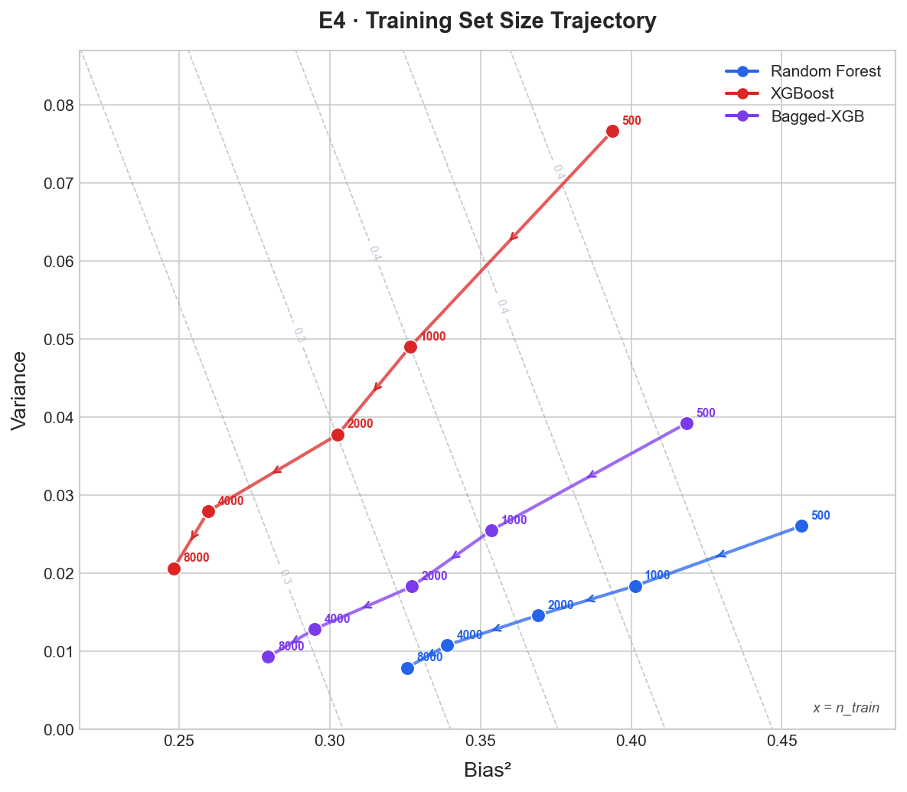 |

### Hybrid Mixing Analysis

| MSE vs λ (Cal Housing, RF+XGB) | MSE vs λ (Synthetic, RF+XGB) |
|:-:|:-:|
| 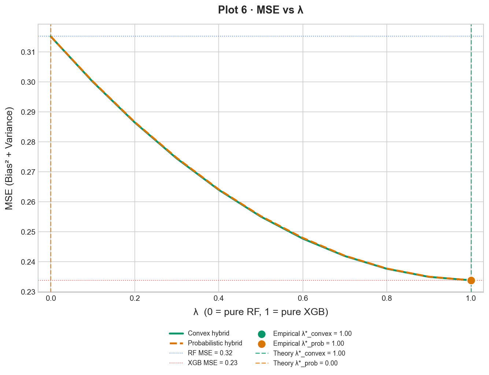 | 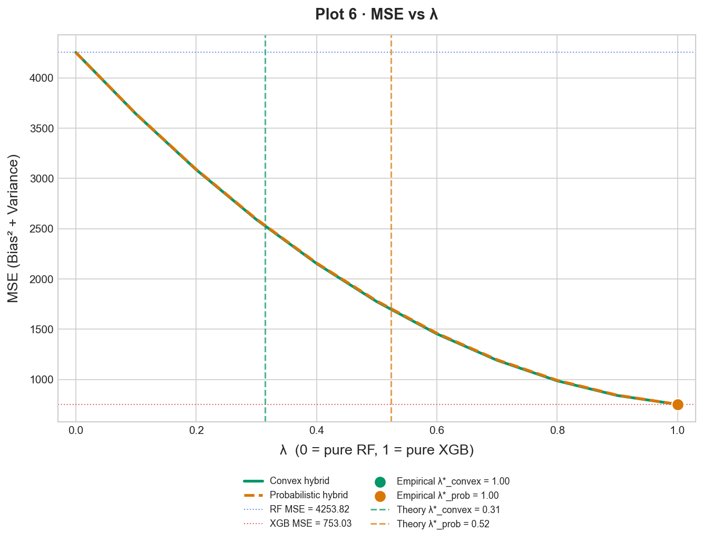 |

| Correlation Structure | Multi-Pair MSE vs λ (Cal Housing) |
|:-:|:-:|
| 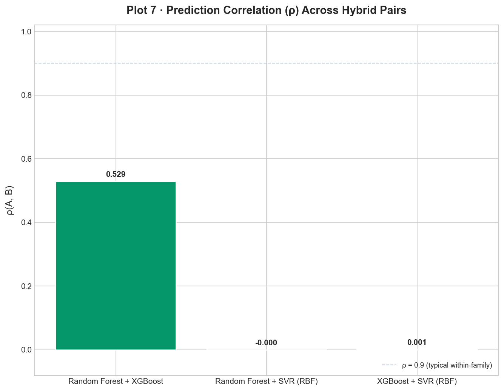 | 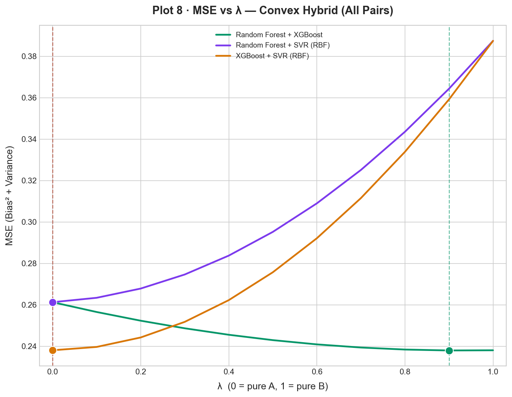 |

---

## Hypotheses

| ID | Hypothesis | Synthetic | Cal Housing |
|----|-----------|-----------|-------------|
| H1 | Orthogonal trajectories in Bias²-Var plane | Confirmed | Confirmed |
| H2 | XGBoost more sensitive to depth than RF | Confirmed† | Confirmed† |
| H3 | XGBoost benefits more from larger training sets | Partial‡ | Confirmed |
| H4 | XGBoost degrades more under noise | Confirmed | N/A |
| H5 | Optimal λ* beats both parent models | Refuted | Refuted |
| H6 | Theoretical λ* matches empirical λ* (±0.1) | Refuted | Refuted |
| H7 | Convex hybrid beats probabilistic hybrid | Refuted | Refuted |
| H8 | Cross-family diversity → mixing gain | Refuted | Refuted |
| H9 | Convex advantage amplified by D² for cross-family pairs | Refuted | Refuted |

† Geometric verdict; MSE-std metric misleading due to axis-scale asymmetry.  
‡ XGB variance drops ~70% (Var: 835 → 245); RF improvement larger only because of high initial bias.

---

## Project Structure

```
bias_variance_pipeline/
├── config.py                 # Global constants, baseline HPs, sweep values
├── pipeline_types.py         # Shared dataclasses (BiasVarianceResult, etc.)
├── main.py                   # Top-level execution script
├── requirements.txt
│
├── data/
│   ├── generators.py         # Synthetic / CaliforniaHousing / CSV data generators
│   └── preprocessor.py       # DataPreprocessor + DatasetVariantManager
│
├── models/
│   └── model_builder.py      # HyperparameterRegistry + ModelBuilder factory
│
├── experiments/
│   ├── bootstrap_evaluator.py  # Bootstrap bias-variance estimator
│   ├── orchestrator.py         # ExperimentOrchestrator (E1–E4)
│   ├── hybrid_engine.py        # Convex + probabilistic hybrid computation
│   └── theory_validator.py     # Analytical lambda* derivation + comparison
│
├── analysis/
│   ├── results_store.py      # ResultsStore (resumable disk-backed cache)
│   └── metrics.py            # MetricsComputer + hypothesis verdict logic
│
└── visualization/
    ├── trajectory_plotter.py  # Bias²-Variance trajectory plots (E1–E4)
    └── hybrid_plotter.py      # MSE vs lambda plots (E5–E6)
```

---

## Mathematical Definitions

**Bias-Variance Decomposition (Bootstrap, M=50 runs):**
```
bias²    = (1/n) Σⱼ (mean_pred[j] - y[j])²
variance = (1/n) Σⱼ Var_i(ŷᵢ[j])
MSE      = bias² + variance  (+ irreducible noise σ²)
```

**Convex Hybrid** `ŷ_λ = λ·ŷ_B + (1-λ)·ŷ_A`:
```
λ*_conv = (Var_A - Cov_AB - (B_A)(ΔB)) / (ΔB² + Var_A + Var_B - 2·Cov_AB)
```

**Probabilistic Hybrid** (model selected randomly per prediction):
```
λ*_prob = (Var_A - Var_B - D² - 2·B_A·ΔB) / (2·ΔB² - 2·D²)
          where D² = E[(μ_A - μ_B)²]
```
